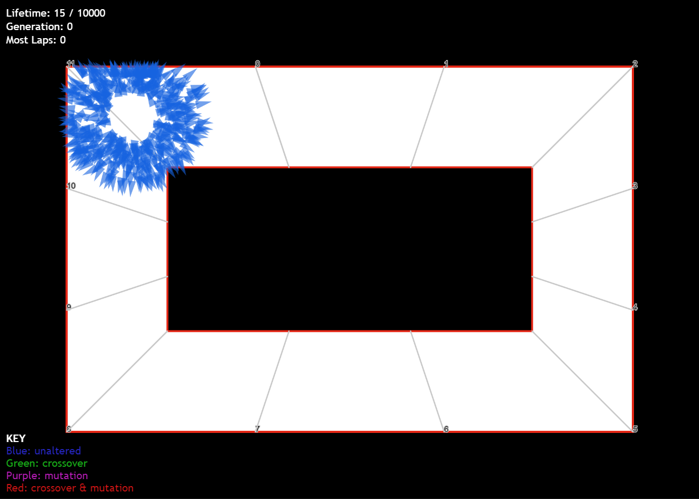
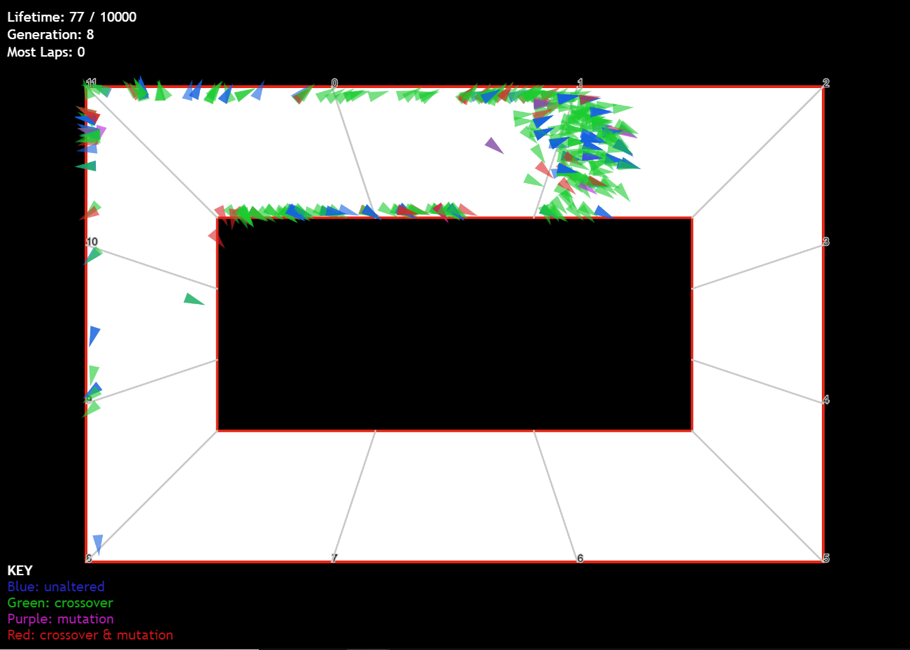
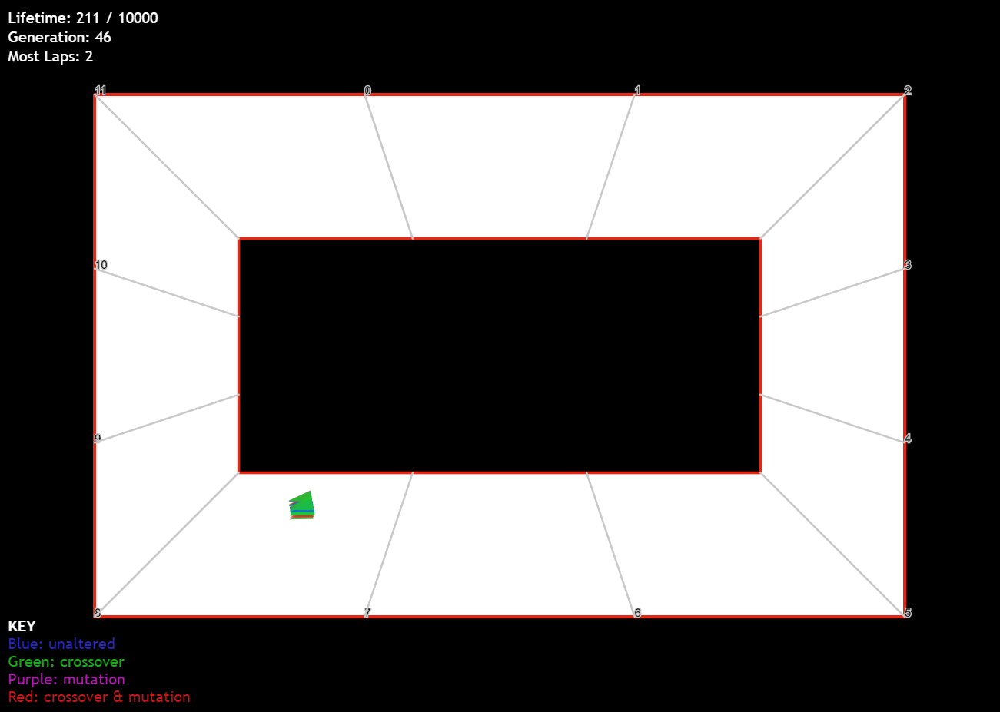

# genetic-driving
Using a genetic algorithm and the p5.js framework to visualise populations of driving agents "learning" to successfully steer around a course. Each driving agent has a maximum speed, a maximum force, and a moveset of vectors which are iteratively applied - one vector per animation frame. It is these attributes which are evolved across generations to produce driving agents which are relatively fast, relatively good at turning, and have a moveset which allows them to manoeuvre the course successfully for the duration of its lifespan.

Each population of driving agents is subject to evolution in order to produce the next population, achieved using a genetic algorithm. The one implemented here uses roulette-wheel selection, applying crossover and mutation to individual agents with given probabilities. The selection process chooses agents based on their "fitness" - the higher the fitness, the more likely an agent is to be picked for evolution. Here, the fitness of a driving agent is a simple function of the number of checkpoints it has passed, the number of full laps it has completed, and its maximum speed. Thus the greater these three values are, the "better" the driving agent is perceived to be.

This process of evolution repeats through many generations of populations, each time producing better and better driving agents that can navigate further around the course. Below is a brief depiction of this learning process at work, with a population size of 500 agents:

# Initial Population
Initially, the population of driving agents all have random vectors in their movesets, and so randomly move through the course until inevitably crashing. Those agents that happen to pass through the most checkpoints are most likely picked for evolution purposes, in the hopes that more agents in the next population will have similar-enough attributes to follow similar paths.

# Early Learning
A few generations in, we can see that a significant portion of the agents have learned to take similar paths to the most successful agents of previous populations - this is enabled by means of genetic crossover. Once many agents begin to take better paths, genetic mutation can allow agents to randomly change course in the later stages of its lifespan, potentially (and hopefully) making it take a better path. This drives the other agents to follow a similar path in the next generation due to crossover, and so on.

# Significant Learning

Once this process has repeated across many generations, we can see significant learning taking place where driving agents take largely similar paths. These similarities usually last until the later stages of their lifespans, where genetic mutation changes the course of many agents, allowing for the development outlined in the previous section to occur.

